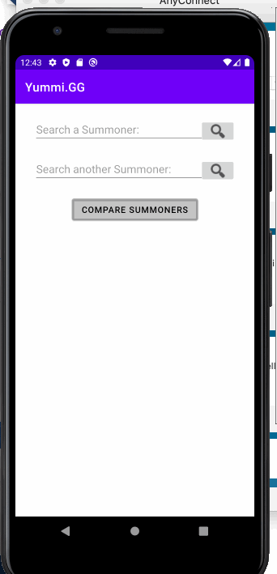
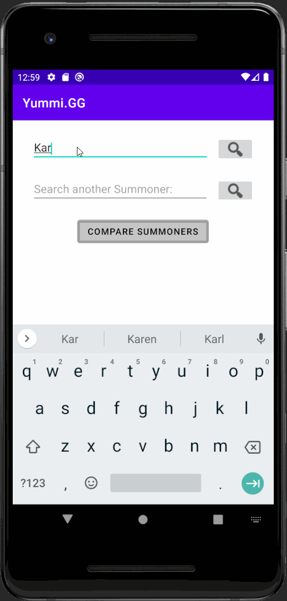

Original App Design Project - README Template
===

# YUUMI.GG

## Table of Contents
1. [Overview](#Overview)
1. [Product Spec](#Product-Spec)
1. [Wireframes](#Wireframes)
2. [Schema](#Schema)

## Overview
Group #3 Project: Yuumi.GG League of Legends Statistics Comparison for Android

### Description
[Yuumi.GG is a League of Legends Statistics Comparison app for Android, it uses League of Legends Summoner V4 Api to gain data about each person and compare your in game statistics between two users both from their recent 20 games as well as information about their rank and recent information about games.]
### App Evaluation
[Evaluation of your app across the following attributes]
- **Category:** Gaming Statistics/Stat Tracker
- **Mobile:** This would be developed as a mobile app as and could be used a companion app before playing the game. You can see your stats to gain a competitive edge before logging onto your ranked ladder. Mobile focused experience.
- **Story:** Analyzes users recent gameplay and overall statistics and lets them compare head to head with other users.
- **Market:** Marketed solely towards League of Legends users. While that may seem like a small demographic, League of Legends is the most popular online game in the world with 115 million active monthly users.
- **Habit:** This app could be used as often as the user wanted, with optimal use case being the user using them before each game to gain insight on themselves and their teammates.
- **Scope:** This is starting as a viewer for stats and a head to head comparison, however in the future we would want to create a system for connecting users in the app and giving hem challenges to best their head to head comparison mate. In the future, potential other games could also be linked with this app and giving more stats in things such as Team Fight Tactics, Valorant, or Project F, Other Riot Games (c) Titles.

## Product Spec

### 1. User Stories (Required and Optional)

**Required Must-have Stories**

*[X] User can Enter their Summoner Name and have it parsed through RIOT's Api. 
*User can recieve information about their games. 
*Names are persisted as recent searches. 
*[X] User can enter another summoner and compare their stats head to head. 
*User can view their recent 20 games or other Summoners 20 games. 
[X] User can navigate to separate screen with detailed stats about summoner. 

**Optional Nice-to-have Stories**

* User can send other Summoners challenges 
* Flexible navigation, adding up to 4 other summoners instead of just 2.
* Styled with League of Legends Assets (Logo, Champions, Ranks, Summoner Icons)
### 2. Screen Archetypes

* [Summoner Search]
   * [User can Enter their Summoner Name and have it parsed through RIOT's Api.]
   * [*Names are persisted as recent searches.]
* [Summoner Data]
   * [*User can enter another summoner and compare their stats head to head]
* [Head to Head Screen]
   * [*User can recieve information about their games.]
* [Summoner Data II (Extended Info)]
    * [*User can view their recent 20 games or other Summoners 20 games.]
   

### 3. Navigation

**Tab Navigation** (Tab to Screen)

* [Summoner Search]
* [Summoner Data]
* [Summoner Data II (Extended Info)]
* [Head to Head]

Optional:
    * [Challenges Tab]
    * [Flexible Head to Head tab (updated)]

**Flow Navigation** (Screen to Screen)

* [Summoner Search] -> Recent Searches filled with persistence.
* [Summoner Data] -> jumps to Extended Summoner Data, Recent 20 games.
* [Extended Summoner Data] -> jumps to Head to head analysis.

## Wireframes
[Add picture of your hand sketched wireframes in this section]

### [BONUS] Digital Wireframes & Mockups

### [BONUS] Interactive Prototype

## Schema 
   | Property      | Type     | Description |
   | ------------- | -------- | ------------|
   | username      | String   | Name identifies each summoner |
   | Summoner Count| Integer| Number ID of summoner signed in |
   | Summoner rank  | String     | Indicated what rank Summoner(s) are |
   | Summoner Level | String   | Indicate the Summoner level |
   | SummonerIconID | Integer   |ID representing Summoner Icon image |
   | ChampionID    | Integer   | Most played characters in game |
   | AVGCS         | Integer | date when post is created (default field) |
   | Winrate       | Integer | date when post is last updated (default field) |
### Networking
#### List of network requests by screen
   - Summoner Lookup Screen
      - (Read/GET) Query Summoner Account Data for basic view
      - (Create/POST) Add a summoner to compare
      - (Update/Put) Add an additional summoner
   - Summoner Data Comparison
      - (Read/GET) View Summoners data
      - (Delete) Remove a summoner from comparison
   - Summoner Info Screen
      - (Read/GET) View Summoner info pulled from Summoner v4 API
    - Side by Side In Depth Comparison
    - (Read/GET) View Additional Summoner info pulled from Summoner v4 API in comparison with the other Summoner

#### 4. Sprint 1:

[X] Add a screen where User can enter another summoner and compare their stats head to head.
[X] Get Ranks from league-v4 API using summonerID

GIFS of Progress on Sprint 1:

#### 5. Sprint 2:
[X] User can navigate to separate screen with detailed stats about summoner. 
[X] Added summoner's profile icon 

#### 5. Sprint 3:
[X] Added persistence to user searching so that summoner stays on reload. 
[X] Added more in depth stats retrieved and reworked summoner info with recyclerview

